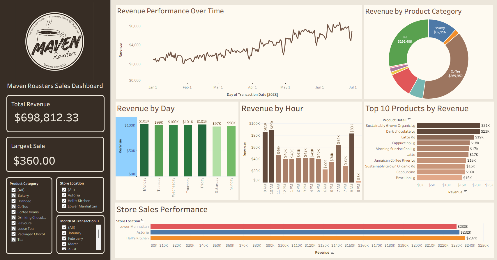

# Maven Roasters Sales Dashboard

Interactive sales analytics dashboard built in Tableau Public using transactional coffee shop sales data from Maven Roasters.

This project analyzes revenue performance across product categories, store locations, time periods, and customer purchasing behavior to generate business insights through data visualization and dashboard storytelling.

---

## Live Interactive Dashboard

[View Dashboard on Tableau Public](https://public.tableau.com/app/profile/meg.riel/viz/Maven_Roasters_Sales_Dashboard/Dashboard1#1)

---

## Dashboard Preview

---

## Project Overview

The goal of this project was to design a professional and interactive business intelligence dashboard that transforms raw transactional data into clear, actionable insights.

The dashboard provides a high-level overview of:
- Revenue performance
- Product category analysis
- Store performance
- Sales trends over time
- Customer purchasing patterns

---

## Key Features

- KPI cards for:
  - Total Revenue
  - Largest Single Transaction

- Revenue trend analysis over time
- Revenue breakdown by:
  - Product Category
  - Day
  - Hour
  - Store Location

- Top 10 products by revenue
- Interactive filters for:
  - Store Location
  - Product Category
  - Month

---

## Business Insights

- Coffee and Tea generated the highest overall revenue
- Morning hours showed peak sales activity
- Certain store locations consistently outperformed others
- A small number of products contributed significantly to total revenue
- Revenue trends increased steadily over time

---

## Tools & Skills Used

### Data Visualization & Analytics
- Tableau Public
- Dashboard Design
- KPI Development
- Interactive Filtering
- Data Storytelling
- Time-Series Analysis
- Revenue Analysis

### Design & Presentation
- Canva
- Logo Design
- Dashboard Layout & UI Styling

This project also demonstrates basic visual branding and presentation skills through the custom Maven Roasters logo created in Canva.

---

## Files Included

- `Maven_Roasters_Sales_Dashboard.twbx`
- `dashboard_preview.png`
- `README.md`

---

## Dataset

Coffee shop sales transaction dataset containing:
- Transaction dates and times
- Product categories
- Product details
- Store locations
- Revenue and sales metrics

---

## Author

Meg Riel
